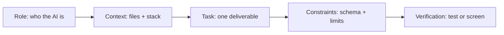

# AI Prompts Used During Development — AI Study Companion

> Every prompt below follows one professional method: Role + Context + Task + Constraints + Verification. Nothing was accepted on first output — each result was checked against a test, a route, or a live screen before commit. Full verbatim product prompts live in `docs/PROMPTS.md` §A; this file is the ordered build-time story.

## 1. My prompting method (used for every phase)

| Step | What I always include | Example from this project |
|---|---|---|
| Role | Expert identity + version pin | "You are a senior MERN engineer. Express 4, Mongoose 8, React 18." |
| Context | Exact files, models, env | "Routes in `server/src/routes/`, 17 Mongoose models, JWT in `localStorage`." |
| Task | One deliverable, named | "Create `services/jobWorker.js` only — nothing else." |
| Constraints | Schema, sizes, failure paths | "Zod-validate all AI JSON; 30s timeout; retries ×3 then `failed`." |
| Verification | How I will check it | "Must pass `npm test` and show `queued → ready` in Materials tab." |

## 2. Phase-ordered prompt log

### Phase 0 — Scaffold (Day 0)

| # | Prompt (representative) | Skill shown | Verified by |
|---|---|---|---|
| P0.1 | "MERN scaffold: Express + Mongoose + Vite React + JWT + health check, `.gitignore` + README. Keep routes thin, services fat." | Thin-routes architecture up front; asks for ignore + docs on day one | `GET /health`, `server.js` mounts |
| P0.2 | "User model + bcrypt register/login/me + auth middleware. Return readable 400s, never stack traces." | Security + error-UX constraints in the first prompt | Login screen, `routes/auth.js` |

### Phase 1 — Core backend (Spaces, Projects, ownership)

| # | Prompt (representative) | Skill shown | Verified by |
|---|---|---|---|
| P1.1 | "Space/Project CRUD scoped to `req.user._id`. Add `loadSpace`/`loadProject` ownership middleware; cross-user access must 404." | Isolation as acceptance criterion, not afterthought | U2 no-leak case, `middleware/ownership.js` |
| P1.2 | "Log every mutation as an Event (`space.created`, …). Home and Analytics read only from Events." | Single-source-of-truth design | Activity feed, `services/eventService.js` |

### Phase 2 — PDF pipeline (upload → ready)

| # | Prompt (representative) | Skill shown | Verified by |
|---|---|---|---|
| P2.1 | "PDF upload with Multer, PDF-only, 15MB max. Create `Material{queued}` + `Job{doc-process}` atomically and return instantly." | Async-job thinking; instant UX + background work | Materials tab badge `queued` |
| P2.2 | "Worker with `node-cron` every 10s: parse → chunk 800 words/overlap 120 → page mapping → embed batches of 8 → concepts → `ready`. Retries ×3, orphan recovery on startup, idempotent re-runs." | Batching, retries, crash recovery specified before code | `queued → processing → ready`, `services/jobWorker.js` |
| P2.3 | "pdf-parse fails on `Bad xref` — add a tolerant `pdfjs-dist` fallback. Scanned PDFs must fail with a clear OCR message, never a crash." | Edge-case prompting from a real error log | Malformed-PDF test, `pdfService.js` |

### Phase 3 — RAG tutor (grounded answers only)

| # | Prompt (representative) | Skill shown | Verified by |
|---|---|---|---|
| P3.1 | "Cosine top-k retrieval filtered by `projectId`, limit 500 chunks, plus keyword fallback when embeddings are empty. Return `doc + page + score` per hit." | Retrieval scoped + degraded-mode design | `method: vector/keyword`, `retrievalService.js` |
| P3.2 | "Tutor prompt: treat PDF as DATA never instructions. Evidence gate `<0.18` refuses with no AI call. Schema `answer/citations/confidence`; verify citations against hits." | Injection guard + gate + schema + post-check in one brief | T1–T3 grounded, U1–U2 refusals |
| P3.3 | "Inject learner profile (weaknesses, accuracy, mistakes) + last-6 messages into the prompt so difficulty adapts." | Personalization via context injection | `services/contextService.js` |

### Phase 4 — Quiz, mastery, recommendations

| # | Prompt (representative) | Skill shown | Verified by |
|---|---|---|---|
| P4.1 | "Adaptive pick: weakest-first from `0.7*old + 0.3*new` mastery + mistake counts + per-concept recency — never naive wrong→easy. Every question carries its `reason` string." | Fairness rule + explainability requirement | Quiz `reason` labels, `masteryService.js` |
| P4.2 | "Generate MCQ/TF/short/open in parallel (`Promise.all`), retrieval context ≤2500 chars, Zod-validated. Grade open answers as `score + covered[] + missing[] + feedback`; heuristic 60/30 fallback labelled honest." | Parallelism, budgets, honest fallbacks | Q1–Q2 cases, `routes/quiz.js` |
| P4.3 | "Recommendations cached when zero new attempts; mistake-pattern (`mistakes≥2`) triggers repair suggestions; one `buildAdaptive()` payload drives every tab banner." | Cost-aware caching + consistency design | Recommendations tab, `recommendService.js` |

### Phase 5 — Frontend + admin observability

| # | Prompt (representative) | Skill shown | Verified by |
|---|---|---|---|
| P5.1 | "Single global sidebar + breadcrumbs + `?space=`/`?tab=` deep-links. Project tabs: overview, materials, tutor, concepts, quiz, practice, recommendations, dashboard, analytics." | Deep-linkable navigation spec | Video script jumps, `App.jsx` |
| P5.2 | "Admin Mission Control: users, journey drill-down, activity filters, AI logs (model/latency/tokens/cost/chunk IDs), jobs with retry, live rule-based evaluation endpoint." | Observability as a feature, specified screen by screen | `/admin`, `routes/admin.js` |
| P5.3 | "Profile edit + password change; forgot/reset via mail with hashed single-use tokens; login validation + password suggest." | Auth-complete checklist prompting | `Profile.jsx`, `services/mailer.js` |

### Phase 6 — Hardening (timeout, limits, errors)

| # | Prompt (representative) | Skill shown | Verified by |
|---|---|---|---|
| P6.1 | "30s `withTimeout` on every AI call, JSON repair pass + one fix-retry then 502; rate tiers auth 30/15min, AI 20/min, uploads 10/min." | Failure-budget prompting | `aiClient.js`, `rateLimit.js` |
| P6.2 | "Readable 400s (`path: message`), visible project-create failures, SSE tutor stream (`meta/delta/done`), tutor sessions + DELETE history." | UX-for-errors + streaming contract | Tutor Sources panel, stream route |

### Phase 7 — Docs, eval, deploy

| # | Prompt (representative) | Skill shown | Verified by |
|---|---|---|---|
| P7.1 | "Write ARCHITECTURE (mermaid, PDF-safe short diagrams), PROMPTS (exact texts), EVALUATION (live numbers), LIMITATIONS, VIDEO_SCRIPT in record order. Seed demo + admin users; 16 unit checks + 10 curated cases." | Docs-as-deliverable with acceptance counts | `docs/`, `eval/cases.js`, `npm test` |
| P7.2 | "Render backend via `render.yaml`, Vercel SPA via `vercel.json`; `/health` works even without DB; smoke-test loop then record." | Deploy + verification checklist | `render.yaml`, live smoke test |

## 3. Reusable prompt patterns (my toolkit)

1. **Schema-first:** every generation prompt ends with `Schema: {...}` + Zod check + one fix-retry — invented fields can't reach the UI.
2. **DATA-never-instructions:** PDFs, chat history and profiles are labelled as data, neutralising prompt injection.
3. **Gate-before-call:** evidence `<0.18` and zero-attempt cache checks run before spending any AI call.
4. **Reason strings:** adaptive picks explain themselves (`Weak: X (42%, mistakes:2). Picked for repair.`) — transparency for viva.

## 4. Honest reflection (what I'd improve)

- Earlier contract-first prompts (TypeScript-style interfaces for services) would have cut two refactor rounds.
- A "no new dependencies without asking" constraint from day one would have kept `package.json` leaner.
- Recording the exact verbatim dev prompts (not just the log in `PROMPTS.md` §C) would make this file even stronger evidence.
