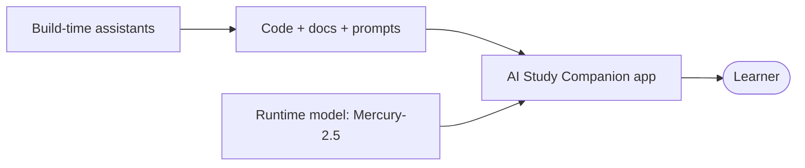

# AI Tools & Usage — AI Study Companion

> One rule for this project: AI assisted the work, humans reviewed everything. Build-time assistants (OpenCode, Muse Spark, Claude) helped write code and docs. Runtime AI (InceptionLabs Mercury-2.5 only) answers learners inside the app.

## 1. Big picture: two kinds of AI use

| # | Category | Tools | Where it runs | Proof |
|---|---|---|---|---|
| 1 | Build-time (dev assistants) | OpenCode, Muse Spark, Claude | Developer laptop, during development | Prompt log in `docs/PROMPTS.md` |
| 2 | Runtime (product feature) | InceptionLabs Mercury-2.5 only | Inside the app, per learner question | `AiLog` rows in Admin panel |

## 2. OpenCode — the coding agent harness

- **What it is:** an open-source agentic coding tool that runs in the terminal. It reads/writes files, runs commands and tests, and drives the whole change end-to-end (explore → edit → verify).
- **What it did here:** scaffolded the MERN project, created all 17 Mongoose models, Express routes, React pages, the `node-cron` worker, seed script, unit tests and every `docs/` file.
- **How it was used:** task by task with verification after each step (`node --check`, `npm test`, manual smoke test of the learning loop). See the gap-fill list in `docs/PROMPTS.md` §C.
- **What it did NOT do:** it never decided product behavior alone — Space → Project → Tutor → Quiz → Mastery flow, evidence gate `0.18`, mastery formula `0.7/0.3` were human decisions, then implemented and tested.

## 3. Muse Spark — the primary model behind OpenCode

- **What it is:** the large language model powering this OpenCode session (built by Meta).
- **What it did here:** generated the first drafts of backend services (`pdfService.js`, `retrievalService.js`, `masteryService.js`, `recommendService.js`), route handlers, frontend pages (`Home.jsx`, `Project.jsx`, `Admin.jsx`), Zod schemas (`aiSchemas.js`), docs and the video script.
- **Debugging help:** syntax checks, error triage (e.g. pdf-parse `Bad xref` fallback to `pdfjs-dist`, orphan-job recovery, citation verification).
- **Recorded in:** `docs/AI_USAGE.md` §"AI used to BUILD the product" and `docs/PROMPTS.md` §C dev prompts log.

## 4. Claude — consulted at build time (review and explanation)

- **Build-time role:** review-style assistant — explaining tricky code back in plain words, checking the RAG evidence-gate logic, quiz grading rubric (`covered/missing/feedback`), and mastery/adaptive-pick fairness (weakest-first, never naive wrong→easy).
- **Docs and viva prep:** helped phrase `ARCHITECTURE.md` explanations, `EVALUATION.md` readings, and the spoken demo script (Space → Project → both PDFs → Tutor → Quiz → Admin).
- **What it did NOT do:** it never runs inside the app. No learner request touches Claude; runtime is Mercury-2.5 only.

## 5. Runtime AI — InceptionLabs Mercury-2.5 (the only model learners meet)

| Feature | What the model does | Guardrail | Code |
|---|---|---|---|
| Tutor answers | Grounded answer from top-4 project chunks | Evidence gate `≥0.18`, else refusal, no AI call | `routes/tutor.js` |
| Citations | Returns `doc + page` | `verifyCitations()` rewrites invented docs/pages to real hits | `routes/tutor.js` |
| Quiz generation | 1 MCQ / TF / short / open per concept | Zod schema + 1 fix-retry, else 502 | `routes/quiz.js` |
| Open-answer grading | `score + covered[] + missing[] + feedback` | Length heuristic fallback (60/30, labelled honest) | `routes/quiz.js` |
| Concept extraction | 5–8 concepts per PDF | Failure never blocks processing | `services/pdfService.js` |
| Recommendations | 1 next step from weakest concepts | Cached, deduped vs last rec | `services/recommendService.js` |
| Flashcards | Front/back cards per concept | Schema-validated, mastery nudge `±4` | `routes/flashcards.js` |

- **Model config:** `INCEPTION_MODEL=mercury-2.5`, reasoning `low`, 30s timeout on every call.
- **Prompt-injection rule:** PDFs, conversation and learner profile are always treated as DATA, never instructions (see `docs/PROMPTS.md` §A).
- **Observability:** every call logs model, feature, latency, tokens, cost estimate, chunk IDs and status to `AiLog` — check Admin → AI logs, Jobs, Evaluation.

## 6. Configuration (env vars)

| Var | Purpose | Used here? |
|---|---|---|
| `INCEPTION_API_KEY` | Mercury-2.5 key (server `.env`, never committed) | Yes — runtime |
| `INCEPTION_MODEL` | Default `mercury-2.5` | Yes |
| `AI_TIMEOUT_MS` | 30s guard on all AI calls | Yes |

## 7. Honesty and review policy

- Every AI-generated file was read by a human before commit; `npm test` (16 checks) and Admin → Evaluation re-run on every prompt/model/retrieval change.
- Prompt record lives in `docs/PROMPTS.md` (product prompts §A exact text, dev log §C); it is updated on every prompt change alongside code.
- Costs in Admin are estimates (blended per-1M pricing); Inception token counts are provider-reported.
- No secrets were ever committed (`.env` git-ignored, only `.env.example` in repo).
