# Architecture — AI Study Companion (MERN + RAG)

> Persistent, contextual, measurable AI learning companion.
> Stack: React Vite + Express + MongoDB Atlas + InceptionLabs Mercury-2.5.
> Learning loop: Space → Project (goal) → Upload PDF → ready → Tutor (cited) → Quiz → Mastery/Growth → Analytics → Recommendation → Admin.

---

## 1. System Overview

The system has 4 parts: **Client (Vite React)**, **API (Express)**, **MongoDB Atlas (17 collections)**, and **AI (InceptionLabs Mercury-2.5)**. All AI answers are grounded in uploaded PDFs via project-scoped RAG. All learning events are stored as first-class data for analytics, admin and evaluation.

### 1.1 System context diagram

Request path (UI to AI):

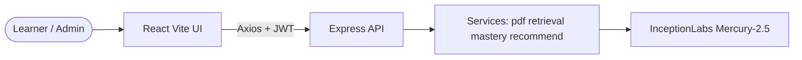

Data and ops path (DB, worker, observability):

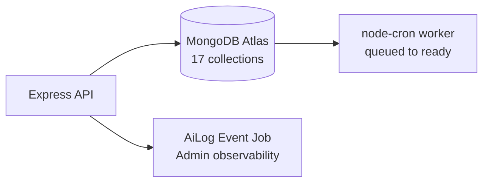

**Explanation:**
- UI never talks to the DB or AI directly. Every call goes through Express with JWT.
- Services hold all business logic. Routes are thin: validate with Zod, check ownership, call a service.
- Worker runs in the same Node process via `node-cron` every 10s. No Redis needed for prototype.
- `AiLog`, `Event`, `Job` make every AI call, user action and background task visible in Admin.

### 1.2 Tech stack

| Layer | Technology | Why |
|---|---|---|
| Frontend | React 18, Vite 5, react-router 6, Axios, Tailwind, Recharts, KaTeX, lucide-react | Fast SPA, deep-links `?space=` `?tab=`, charts for analytics, math rendering |
| Backend | Express 4, Mongoose 8, Zod, jsonwebtoken, bcryptjs, multer, pdf-parse + pdfjs-dist, node-cron, nodemailer | One language, MERN team strength, schema validation at boundary |
| DB | MongoDB Atlas `ai-study-companion` | Flexible docs for chunks, messages, mastery history |
| AI | InceptionLabs Mercury-2.5 via `inceptionClient.js` | Single provider (`INCEPTION_MODEL`, `INCEPTION_API_KEY`), timeout + schema validation |
| Deploy | Render backend `render.yaml`, Vercel frontend `vercel.json` | Zero-ops prototype hosting |
| Quality | `server/tests/run.js` 16 checks, `eval/cases.js` 10 cases, Admin live evaluation | Regression gate before every push |

---

## 2. Frontend Architecture

### 2.1 Navigation and pages

Top-level navigation:

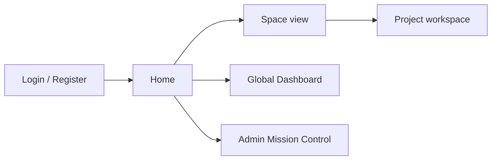

Project workspace tabs (`/project/:id?tab=`):

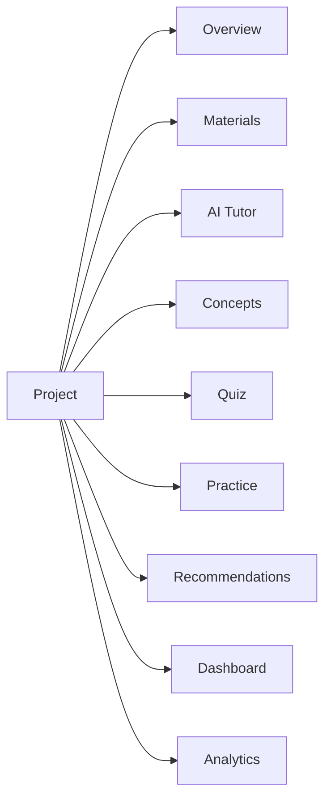

**Explanation:**
- `App.jsx` owns global `Sidebar`, `Topbar`/`AdminBar`, breadcrumbs (`crumbs.js`), dark mode and route guards. Unauthenticated users redirect to `/login`.
- Learner sees `Home`, `Project`, `Dashboard`, `GlobalAnalytics`, `Profile`. Admin (`isAdmin`) sees `Admin` Mission Control instead.
- Project workspace has 9 tabs: `overview, materials, tutor, concepts, quiz, practice, recommendations, dashboard, analytics`. `?tab=` deep-link lets video script jump directly.
- `AdaptiveBanner` renders on every tab from one `buildAdaptive()` payload, so the next step is consistent everywhere: weakest concept → quiz / flashcards / tutor action.
- `api/client.js` attaches JWT from `localStorage`, handles 401 logout. `MathText.jsx` renders LaTeX via KaTeX. `Shimmer.jsx` skeletons keep perceived latency low during jobs and AI calls.

---

## 3. Backend Architecture

### 3.1 Layered request pipeline

Middleware chain (every request passes these gates):

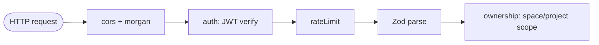

Handler chain (thin routes, fat services):

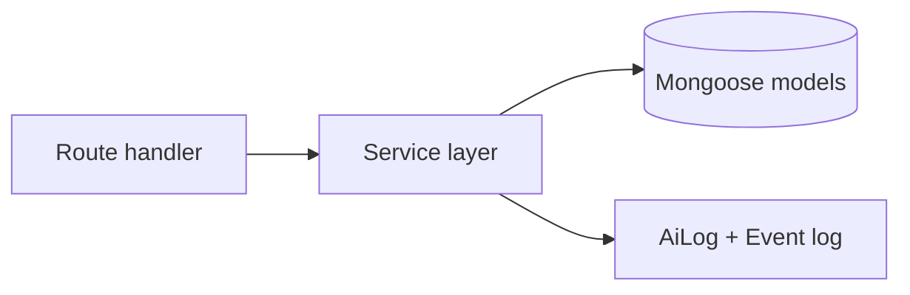

**Explanation:**
- `server.js` mounts routes: `/api/auth`, `/api/spaces`, `/api/projects`, `/api` (materials, tutor, quiz, flashcards, analytics), `/api/admin`. Central error handler maps `ZodError` to 400 with field messages.
- `middleware/auth.js` verifies JWT. `middleware/ownership.js` guarantees project isolation: a user can only load their own `Space`/`Project`. This is what makes U2 (no cross-project leak) pass.
- `middleware/rateLimit.js` uses `express-rate-limit` tiers so bulk uploads and AI loops cannot DoS the server.
- Routes never embed prompts. They call services and validate AI JSON with `aiSchemas.js` (Zod). One fix-retry, then 502 with honest message.

### 3.2 Folder map

```
server/server.js              entry, cors, routes, worker start
server/src/config/db.js       Mongoose connect
server/src/middleware/        auth, ownership, rateLimit
server/src/models/            17 schemas (below)
server/src/routes/            auth spaces projects materials tutor quiz flashcards analytics admin
server/src/services/          pdfService retrievalService contextService masteryService
                              recommendService aiClient inceptionClient aiSchemas
                              eventService evalService jobWorker mailer cleanup
server/tests/run.js           16 unit checks, no key needed
eval/cases.js                 10 curated cases T1-T3 U1-U2 R1-R2 Q1-Q2 C1
client/src/                   api pages components crumbs
```

---

## 4. Data Model — 17 Collections

### 4.1 Entity relationship diagram

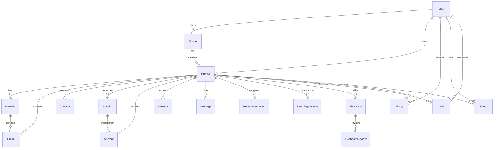

**Explanation:**
- Identity chain: `User → Space → Project`. Everything learning-related hangs off `Project + User`, so deleting a project cascades cleanly (`cleanup.js`).
- RAG chain: `Material (filePath, status, pages)` → `Chunk (text, page, embedding, material, project)`. Chunks carry `page` for citations and `embedding` for cosine search.
- Learning chain: `Concept` → `Question (stem, options, answerKey, concept, difficulty)` → `Attempt (score, covered, missing)` → `Mastery (score, mistakes, history[30])` → `LearningContext` + `Recommendation`.
- Memory chain: `Message (role, text, citations, session)` powers tutor history and multi-chat sessions.
- Observability chain: `AiLog (model, feature, latency, tokens, cost_est, retrievalIds, status)`, `Event (type, payload)`, `Job (type, status, retries, error)` feed Admin and live evaluation.

Key fields:
- `Mastery.score = round(0.7*old + 0.3*new)`, `mistakes++` when score < 60.
- `Chunk.embedding` may be empty when no key — retrieval falls back to keyword automatically.
- `Material.status`: `queued → processing → ready | failed`, with `progress` + `stage` for live UI.

---

## 5. Material Ingestion Pipeline

### 5.1 Upload to ready sequence

Part A — upload and queue (instant response):

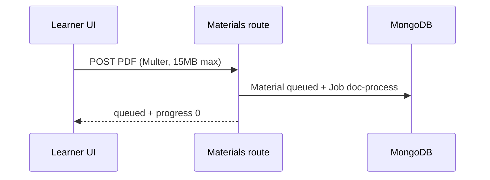

Part B — background worker (polls every 10s):

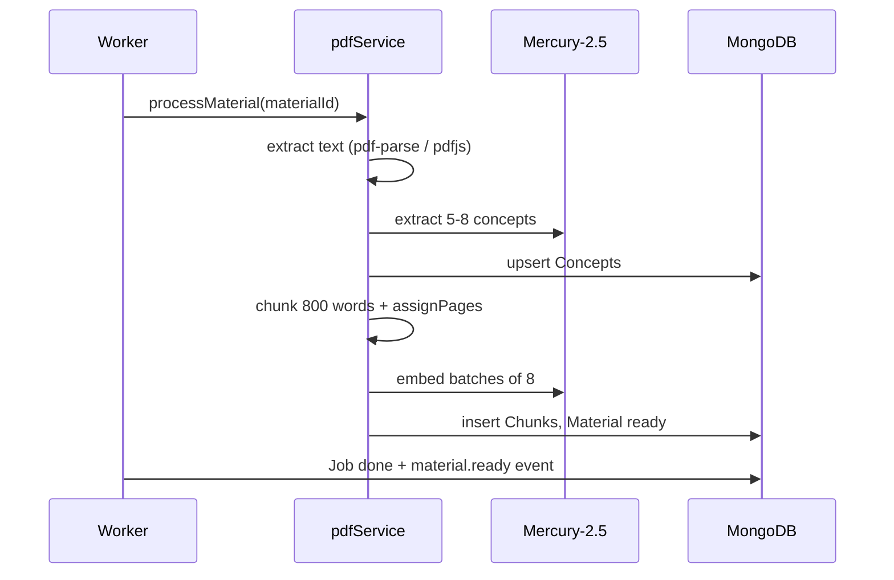

**Explanation:**
- Upload validates MIME and size in route, saves file to `server/uploads/`, creates `Material{status:queued}` and `Job{type:doc-process}` atomically.
- Worker `jobWorker.js` polls every 10s, claims one job, runs `processMaterial`. Retries ×3, then `failed` with clear message (e.g. scanned PDF needs OCR, bad magic bytes, missing file after ephemeral restart).
- Concepts extract first so Concepts tab populates fast. Chunking and embedding continue after.
- `assignPages()` maps each chunk to a real page via `\f` split probe, else positional mapping. This is what makes citations `Doc — Page N` truthful.
- Orphan recovery on startup resets `processing` jobs older than 2 min to `queued`. Duplicate-safe: re-processing deletes old chunks first, skips if already `ready`.

---

## 6. Tutor RAG Pipeline — Grounded Answers Only

### 6.1 Grounded answer flow

Part A — retrieval and evidence gate:

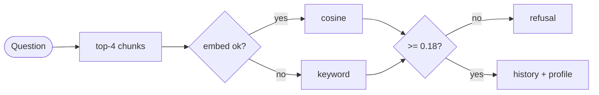

Part B — grounded generation:

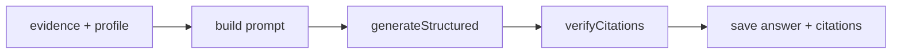

**Explanation:**
- Retrieval is always project-scoped: `Chunk.find({project})`. Cross-project leak is impossible by query construction.
- `embed([question])` uses deterministic local hash embeddings in this Inception-only deploy (no extra embedding key needed). If vectors are empty, keyword fallback scores by long-word overlap. UI shows `method: vector | keyword`.
- Evidence gate `< 0.18` returns canned refusal with no AI call. This is the U1/U2/R2 evaluation path.
- Prompt treats PDFs as DATA never instructions (prompt-injection guard), injects `goal + learner profile (weaknesses, strengths, recent accuracy, recent mistakes) + last-6 messages + chunks ≤1200 chars each`.
- Output schema `{"answer","citations":[{"doc","page"}],"confidence"}` validated by Zod. `verifyCitations()` rewrites any invented doc/page to the real hit.
- Streaming variant `POST .../tutor/stream` runs the same pipeline over SSE events `meta / delta / done`.

---

## 7. Quiz, Grading, Mastery Loop

### 7.1 Adaptive quiz flow

Part A — adaptive generation:

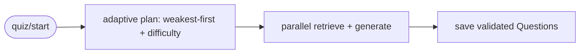

Part B — grading and mastery update:

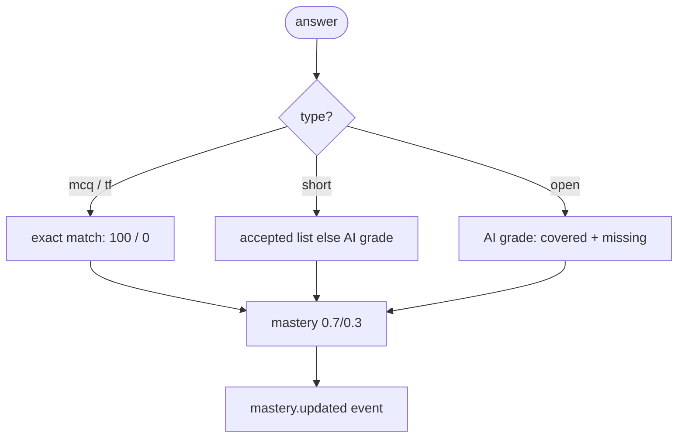

**Explanation:**
- Priority is NOT naive wrong→easy. `pickNextConcept` scores `0.4*(100-score) + 0.3*mistakes + 0.2*per-concept recency + 0.1`. Low mastery + repeated mistakes on THIS concept wins. Same concept never repeats back-to-back when alternatives exist.
- Difficulty adapts: `<50 easy, >=80 hard, else medium`. Every question carries `reason` shown in UI (transparency for viva).
- Generation is parallel (`Promise.all`) — was 4 sequential AI rounds, now one wave. Retrieval context ≤2500 chars per question.
- Flashcards also nudge mastery `±4` (`updateMasteryForFlashcard`) so spaced repetition feeds the same map.
- Growth buckets derive from history delta: `>=+5 improving, <=-5 needs-attention, else stable`.

---

## 8. Personalization — Context and Recommendation

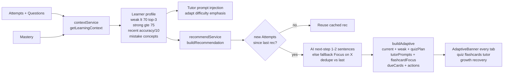

**Explanation:**
- `LearningContext` persists `weaknesses, strengths, repeatedMistakes>=2, recentAccuracy, summary` after every attempt (fire-and-forget, never blocks grading).
- Tutor uses the live slice, not the stale doc — always current weaknesses.
- Recommendations are cached: zero new attempts → return last rec, zero extra AI cost. New evidence → regenerate, dedupe identical text.
- `buildAdaptive` is the single payload for all banners, so Overview, Tutor, Quiz and Analytics never disagree on the next step.

---

## 9. Observability, Evaluation and Admin

Part A — everything is logged:

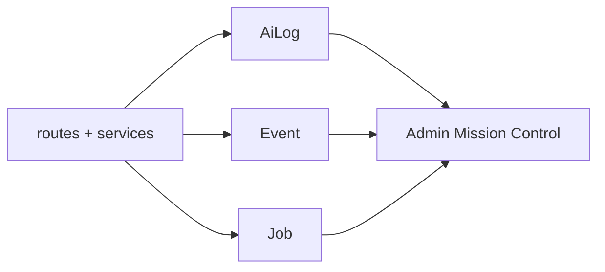

Part B — admin acts on it:

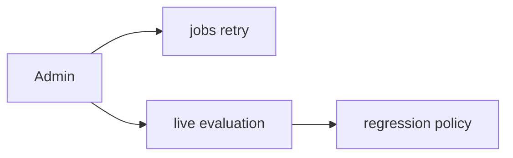

**Explanation:**
- Every AI call logs provider, model, feature (`tutor, quiz-gen, concept-extract, embed, recommend`), latency, estimated tokens (`len/4`, real `usage.total_tokens` for Inception), cost estimate (blended per-1M, env-overridable), chunk IDs and status. Admin → AI logs shows it.
- Events power Home (Continue/Attention/Next), Analytics charts (Recharts bar + line), activity feed and global analytics.
- Live evaluation `GET /api/admin/evaluation` computes from production data: citation rate (grounded only 1.0), unsupported refusals, AI call volumes, overall error rate (embed fallback by design), quiz grading volume. Last run 2026-09-17 on dev Atlas recorded in `EVALUATION.md`.
- Regression: prompt/model/retrieval change must re-run `npm test` (16/16) + Admin Evaluation and record table. Drop in citation rate or rise in feature errors blocks the change.

---

## 10. Security, Validation and Guardrails

| Concern | Implementation | File |
|---|---|---|
| Auth | JWT register/login/me, bcrypt hash, single-use hashed reset tokens via mail | `routes/auth.js`, `middleware/auth.js`, `services/mailer.js` |
| Isolation | `loadSpace`/`loadProject` check `user` on every read/write | `middleware/ownership.js` |
| Validation | Zod on every body + AI output schemas, readable 400 errors | `routes/*`, `services/aiSchemas.js` |
| Prompt injection | PDFs/conversation/profile treated as DATA never instructions; citations verified against hits | `routes/tutor.js`, `routes/quiz.js`, `PROMPTS.md` |
| Abuse | Rate limits auth 30/15min, AI 20/min, uploads 10/min; PDF-only 15MB Multer; 1mb JSON limit | `middleware/rateLimit.js`, `routes/materials.js` |
| Timeouts | 30s `withTimeout` on all AI calls, JSON repair pass + fix-retry once | `services/aiClient.js`, `services/inceptionClient.js` |
| Secrets | Never committed `.env`, `server/.env.example` documents keys | `.gitignore`, `.env.example` |

---

## 11. Deployment

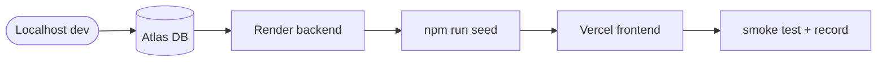

**Explanation:**
- Atlas: Network Access `0.0.0.0/0`, database user, `ai-study-companion` DB.
- Render: repo → New Web Service, `render.yaml` fills build (`npm install`) and start (`node server.js`), secret env vars set in dashboard. Health check `/health` works even without DB.
- Vercel: import `client/`, set `VITE_API_URL` to Render URL. `vercel.json` rewrites all routes to `index.html`.
- Post-deploy: `npm run seed` against prod DB, run learning loop once, record video per `docs/VIDEO_SCRIPT.md`.

---

## 12. Decisions, Simplifications, Future

**Decisions (why):**
- **MERN only** — team strength; one language, one backend deploy.
- **Jobs collection + node-cron** over Redis/BullMQ — zero infra for prototype, same states/retries/idempotency.
- **Cosine in Node + keyword fallback** over pgvector/Atlas Vector Search — no extension setup; works without keys via hash embeddings / keyword path.
- **Single AI provider (Inception Mercury-2.5)** — generation via `inceptionClient.js` chat completions; timeout + schema validation at boundary.
- **Events + AiLog as first-class collections** — analytics, admin and rule-based evaluation read the same truth.

**Simplifications (prototype, see LIMITATIONS_FUTURE):**
- No OCR (scanned PDFs fail with clear message), text-only extraction.
- Single-process worker; recommendations cached, not background-generated.
- Token counts estimated except Inception (real usage); costs are estimates.
- No streaming tutor UI by default (SSE endpoint exists), no Redis cache, no Atlas Vector Search.
- Learning workflow runs inline post-answer, not a separate background chain.

**With more time:** BullMQ + Redis, Atlas Vector Search, streaming tutor UI, flashcards/spaced repetition expansion, refresh-token rotation, Sentry tracing, true background learning workflow (quiz-completed → evaluate → mastery → insight → recommend as jobs).
