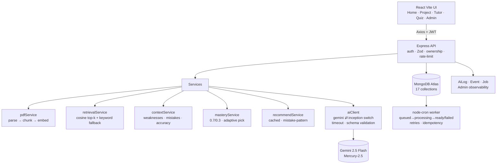

# Architecture — AI Study Companion (MERN + RAG)

## Diagram

## Request flows
- **Tutor:** question → embed → project-scoped top-4 chunks → evidence gate (≥0.18) →
  prompt (goal + learner profile + last-6 msgs + chunks) → validated JSON
  → `{answer, citations[doc+page], confidence}` or insufficient-evidence refusal.
- **Material:** upload (Multer, PDF-only 15MB) → `Material queued` + `Job` →
  worker parses, chunks (~800 tok + page), embeds (batched ×8, fallback keyword),
  extracts concepts → `ready`. Retries ×3, duplicate-safe.
- **Quiz:** adaptive pick (mastery + mistakes + recency, never naive wrong→easy) →
  parallel retrieval+generation → MCQ auto-grade / open-ended structured grade
  (covered/missing/feedback) → mastery update → mistake-pattern check →
  context refresh → events (`quiz.answered`, `assessment.completed`, `mastery.updated`).

## Decisions (why)
- **MERN only** — team strength; one language, one backend deploy.
- **Jobs collection + node-cron** over Redis/BullMQ — zero infra for prototype,
  same states/retries/idempotency guarantees.
- **Cosine in Node + keyword fallback** over pgvector/Atlas Vector Search —
  no extension setup; embeddings optional (system works without keys).
- **Provider abstraction (`AI_PROVIDER`)** — Gemini vs InceptionLabs Mercury
  without touching callers; timeout + schema validation at the boundary.
- **Events + AiLog as first-class collections** — analytics, admin, and
  rule-based evaluation all read the same truth.

## Simplifications (prototype, documented in LIMITATIONS)
- No OCR (scanned PDFs fail with a clear message), text-only extraction.
- Single-process worker; recommendations cached (not background-generated).
- Token counts estimated except Inception (real usage); costs are estimates.
- No streaming tutor, no Redis cache, no Atlas Vector Search.
- Learning workflow runs inline post-answer (not a separate background chain).

## With more time
BullMQ + Redis, Atlas Vector Search, streaming tutor, flashcards/spaced
repetition, refresh-token rotation, Sentry tracing, true background learning
workflow (quiz-completed → evaluate → mastery → insight → recommend as jobs).
